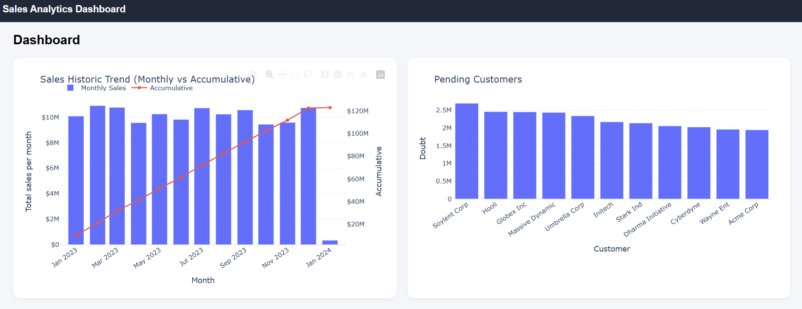

# ETL Analytics Platform

ETL platform built with:

- 🐳 Docker (Docker version 29.2.0) & Docker Compose (Docker Compose version v5.0.2)
- 🗄 MySQL (8.0.45)
- ⚙️ Custom ETL pipeline (Python 3.12.3)
- 🌐 Django API (6.0.2)
- 📊 Plotly Dashboards

# 📌 Architecture

```
       +------------------+
       |     Raw Data     |
       |     (CSV)        |
       +---------+--------+
                 |
                 v
       +------------------+
       |        ETL       |
       | Clean & Transform|
       +---------+--------+
                 |
                 v
       +------------------+
       |      MySQL       |
       | Fact & Dim Tables|
       +---------+--------+
                 |
                 v
       +------------------+
       |      Django API  |
       |   + Plotly UI    |
       +------------------+
```

# 📊 Data Model (ER Diagram)

This project implements a Dimensional Data Warehouse (Star Schema) with a staging layer and data quality handling.

### Schema Type
- ⭐ Star Schema
- 📈 Optimized for analytical queries (OLAP)
- 📊 Designed for aggregation and dashboard reporting

### Why Dimensional Modeling?

This structure enables:

- Fast aggregations
- Clean separation of facts and dimensions
- Easy filtering (e.g. pending invoices)
- Scalability for future dimensions (date, product, region)

### Schema Overview

The architecture is divided into:

- Staging Layer: Raw ingestion table used before transformation.
- Dimension Tables: Stores descriptive business information.
- Fact Table: Central measurable table storing business events.
- Rejected Records Table: Stores invalid records during ETL validation.

### Core Tables

<br><b>Fact Table</b>

Stores measurable business events.

| Column | Description |
|--------|------------|
| invoice_id | Business invoice identifier |
| issue_date | Invoice date |
| total | Invoice amount |
| customer_key (FK) | Reference to dim_customer |
| status_key (FK) | Reference to dim_status |

<br><b>Customer Dimension Table</b>

Stores descriptive customer information.

| Column | Description |
|--------|------------|
| customer_key (PK) | Surrogate key |
| customer_id | Natural key |
| customer_name | Customer name |

<br><b>Status Dimension Table</b>

Stores invoice status information.

| Column | Description |
|--------|------------|
| status_key (PK) | Surrogate key |
| status_name | Status label (PAID, PENDING, CANCELLED) |

<br><b>Item Dimension Table</b>

Stores item or service information.

| Column | Description |
|--------|------------|
| item_key (PK) | Surrogate key |
| item_description | Item name/description |

## Entity Relationship Diagram


```
                +------------------+
                |   dim_customer   |
                +--------+---------+
                         |
                         |
                         v
+-----------+     +------------------+     +-----------+
| dim_item  |---->|   fact_invoices  |<----| dim_status|
+-----------+     +------------------+     +-----------+
                         |
                         |
                         v
                +------------------+
                |    stg_invoices  |
                +------------------+

                +------------------+
                | rejected_invoices|
                +------------------+

```

# 📂 Project Structure

```
.
├── api/ # Django project + dashboard
├── etl/ # ETL logic
├── db/ # MySQL Docker build + init.sql
├── data/ # Input data files
├── docker-compose.yml
├── .env
└── README.md
```


# ⚙️ Environment Configuration

Create a `.env` file in the project root:

```
=========================
MYSQL
=========================

MYSQL_ROOT_PASSWORD=rootpass
MYSQL_DATABASE=data_eng
MYSQL_USER=etl_user
MYSQL_PASSWORD=etl_pass

DB_HOST=db
DB_PORT=3306

=========================
ETL
=========================

INPUT_DIR=/data
LOG_DIR=/etl/logs
ALLOW_MISSING_INVOICE_ID=false

=========================
DJANGO
=========================

DJANGO_SECRET_KEY=django-insecure-change-me
DJANGO_DEBUG=1
DJANGO_ALLOWED_HOSTS=*
```
# 🚀 Installation & Run

## 1️⃣ Build containers

```
docker compose build
```

## 2️⃣ Start services
```
docker compose up -d
```

## 🌐 Access the Dashboard
```
http://localhost:8000/visualization/dashboard/
```

- 📊 Dashboard Features
- 📊 Monthly sales (bar chart)
- 📈 Cumulative revenue (line chart)
- 📉 Pending customers analysis
- Responsive layout
- Interactive hover and formatting

<br>

